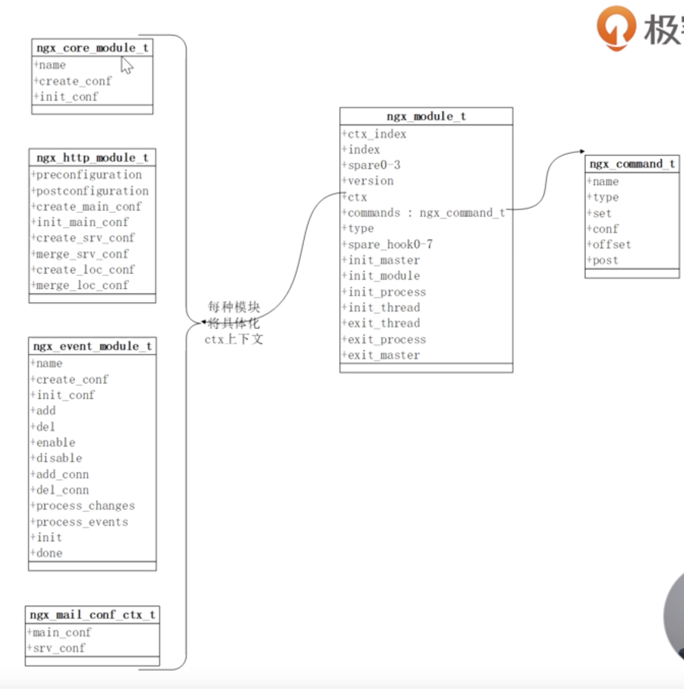

<!-- MarkdownTOC autolink=true levels="1,2,3,4,5" -->

- [Nginx](#nginx)
  - [configuration](#configuration)
  - [start](#start)
  - [static resources service](#static-resources-service)
  - [anti proxy](#anti-proxy)
  - [goAccess](#goaccess)
- [TODO](#todo)
  - [SSL TLS](#ssl-tls)
  - [Lua in OpenResty](#lua-in-openresty)
  - [Nginx Architecture](#nginx-architecture)
  - [Web tool](#web-tool)
  - [epoll, poll, select](#epoll-poll-select)
    - [inter-process communication](#inter-process-communication)
    - [ngx hash](#ngx-hash)
    - [ngx_rbtree](#ngx_rbtree)
    - [shared object](#shared-object)
    - [Realip module](#realip-module)
    - [return & error_page](#return--error_page)
    - [rewrite](#rewrite)

<!-- /MarkdownTOC -->


# Nginx

## configuration
1. http
1. server
1. upstream
1. location

## start

```sh
./nginx

# hot delploy
cp -r /compiling_dir/objs/nginx /installed_ngins/sbin/ -f
kill -USR2 running_nginx_pid
kill -WINCH old_nignx_pid  # close old worker process gentel
# old master process are alive for easy rollback (using reload command)

# change config
./nginx -s reload

# split log
mv old.log bak_dir/
./nginx  -s reopen
# log splite can be done via crontab

```

## static resources service
```
log_format format_name '$remove_addr - $remote_user [$time_local] "$request" '
'$status $body_bytes_sent "$http_referer"'
'"$http_user_agent" "$http_x_forwarded_for"';

gzip on;	# turn gzip
# gzip_min_length	gzip_types	gzip_comp_levels

location / {
	alias mydir/; 	# static resource dir

	autoindex on;		# files can be accessed vir http://ser:port/dir/filename
	#set $limit_rate 1k; 	# return speed, e.g. control bandwith of big files return to make chances for small files return

	access_log  logs/my.server.access.log  format_name; # name defined above
}
```

## anti proxy

* business server
```
server { 
    listen ip:8080;
}
# restart nginx - not reload since port change
```

* proxy server with cache
```
upstream local {
	127.0.0.1:8080; #ip:port configed in each server's nginx.conf
}

proxy_cache_path /tmp/nginxcache levels=1:2 keys_zone=my_cache:10m max_size=1g inactive=60m use_temp_path=off;

location {
	proxy_pass http://local;

	# let business server get info from client (not proxy)
	proxy_set_header Host $host;
	proxy_set_header X-Real_IP $remote_addr;

	# proxy_cache
	proxy_cache my_cache; 		# my_cache is the keys_zone configed previous
	proxy_cache_key $host$uri$is_args$args;
	proxy_cache_valid 200 304 302 1d;	# codes not return
}
```


## goAccess

# TODO

## SSL TLS


* certificate
  * DV - domain validated
  * OV - origanization validated
  * EV - extended validation

* nginx server sends two certificates to browser/client
  * server cert
  * second level cert
  * root CA is not sent since it is contained by browser/OS

* CSR - request certificate issuance
* performance improvement
  * for small files - asymmetric algo e.g. `ECDHE`
  * big files - e.g. `ACE`

* steps
  1. client hello
    * supported ciphers
    * random number
    * session id
  1. server hello
    * choosen ciphers
    * random num
    * session id (re-use or new)
  1. server cert
  1. server hello
    * done
  1. clientkey exchange message (C -> S)
    * encrypted premaster secret
  1. key generation (client and server)
  1. cipherSpec exchange / finished (C -> S)
  1. cipherSpec exchange / finished (S -> C)


* config
```
yum install python2-certrot-nginx
certbot --nginx --nginx-server-root=/usr/local/nginx/conf -d my.server.org
```

## Lua in OpenResty
```
location {
	default_type text/html;
	content_by_lua 'ngx.say(ngx.req.get_headers()["User-Agent"])';
}
```

## Nginx Architecture
* multiple process
  * worker processes have the same num with num of cpu kernel
    * high performance - use all cpu kernels
    * high availibility
    * when using multiple threads, one crash thread may make the process stop
  * master - child communicate via signal
  * child processes communicate via shared memory???signal???

```
kill -SIGHUB master_pid 	# is same with
./nginx -s reload

# stop a child process, send CHLD signal to master, master process would open a new child
kill -SIGTERM child_pid
```

* signal and command
```
reload: HUB
quit:	QUIT
stop:	TERM // INT?
reopen:	USR1

# signals only available to master, and no corresponding command
USR2
WINCH
```

## Web tool

* wireshark


## epoll, poll, select

* poll & select
  * where there has ready event, kernel parse all event queue, including unready ones
* epoll
  * `rdr` - red-black tree stores all events/connections
  * `rdllink` - all ready connections/events

* performance
  * traditional app server 
    * multiple process/thread, it has interchange between them, it is slow for huge num of connections
  * nginx
    * single process, no interchange
    * javascript, openresty have sync & non-block functions

* Nginx Modules
  * 

* `worker_connections` config
  * default is 512
  * each connections is `ngx_connection_s` (232 bytes) and read/write arrays `ngx_event_s` (96 bytes)
  * so, each connections is (232 + 96 * 2) bytes on 64bit system

* `ngx_connections.pool`
  * one connection cound have many request (one connection with multiple read), e.g. keep_alive option
  * `connection pool` - only allocate once when connection, reuse, it is small (default is `512` bytes)
  * `request pool` - alloc for every request, defualt is `4k`, because it has more big context content

* `ngx_cycle_t`
   ```
   connections; // 232 bytes on 64bit OS, connection pool, type `ngx_connection_s`
   read_events; // 96 bytes on 64bit OS, `ngx_event_s`
   write_events; 
   * pool;  // `connection_pool_size`
   ```
   * `read_events` and `write_events` have the same size with `connections`
   * `connections` is used for client connections and upstream connections
     * that means, if `nginx` is used as static resource server, each conn from client would spend two connections
       * one from client to nginx server, the other one is from nginx server to upstream server

* memory pool
  * connection memory pool - each connection
    * `connection_pool_size` - 256/512
  * request memory pool    - each request in one connection
    * `request_pool_size` - 4k
    * request pool size is larger than connection, because connection only need small size, but eace connection may use larger size

### inter-process communication

* basic ways
  * signal
  * shared memory

* advanced ways
  * lock
  * slab memory management tool
    * RB-tree, linked list
    * slot - best fit, good for small size data
    * `curl http://localhost:80/slab_stat`
    * `tengine` by taobao
* `slab_stat` module to allocate the shared memories

### ngx hash

* only static hash table, no insert/delete/update
* alignment - same with CPU cache line (perfer 64 bytes)
  * bucket_size - each item size
  * cpu has L1, L2, L3 caches
* max_size - capacity

### ngx_rbtree

* self-balance binary searching tree
* O()
  * insert/delete/update/search - `O(log(n))`
  * traverse - `O(n)`
* height - no more than `2*long(n)`


### shared object

* nginx executable 
* module shared object
  * `dll` , `so`
  * `nginx.conf`
  ```
  load_module modules/ngx_http_image_filter_module.so;
  localtion / {
  ...
      image_filter resize 15 10;  # image resize to 15x10 
  ```

### Realip module 

Changing client IP
At **post-read** phase.

* realip is not included in nginx by default
  * `--with-http_realip_module`

* how to get real ip?
  * HTTP header
    * `X-Forwarded-For` - all ip path (CDN, proxy)
    * `X-Real-IP`       - real client IP
  * nginx
    * `binary_remote_addr`
    * `remote_addr`  

```
server {
  server_name realip.test.com;
  set_real_ip_from 127.0.2.3;
  real_ip_recursive on; # ignore recursive ip
  real_ip_header X-Forward-For;

  location / {
    return 200 "real client ip: $remote_addr\n";
  }
}
```
* test

```
curl -H "X-Forward-For: 1.1.1.1,127.0.2.3" my.web.com
1.1.1.1    # if real_ip_recurisve off, it would be 127.0.2.3
```

### return & error_page

occurs in `rewrite` phase.

```
server {
  server_name return.test.com;
  listen 8080;
  root html/;

  error_page 404 /404.html;         # top priority
  #return 405;                      # second priority
  location /{
    return 404 "nothing found!\n";  # third priority
  }
}
```

### rewrite

* flag
  * last
  * break
  * redirect
  * permanent
```
rewrite_log on;
error_log logs/rewrite_error.log notice;

location /first {
  rewrite /first(.*) /second$1 last;
  return "this is first!\n";
}
```


